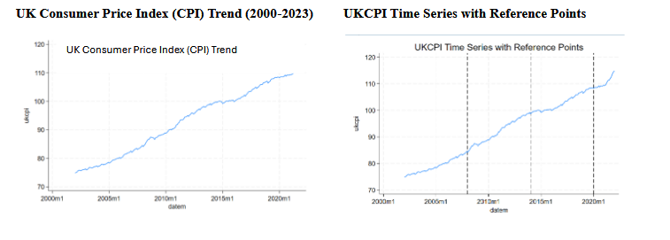
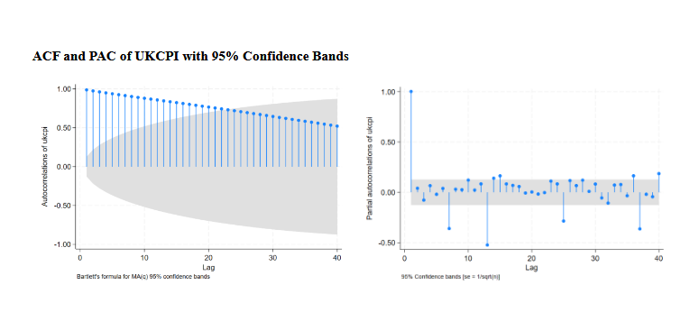
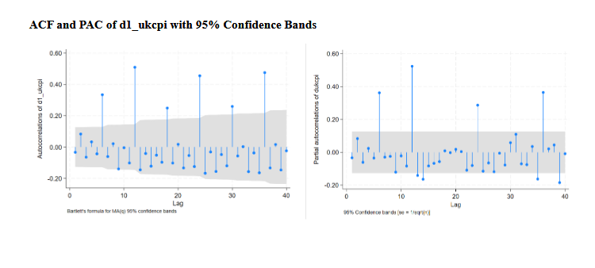
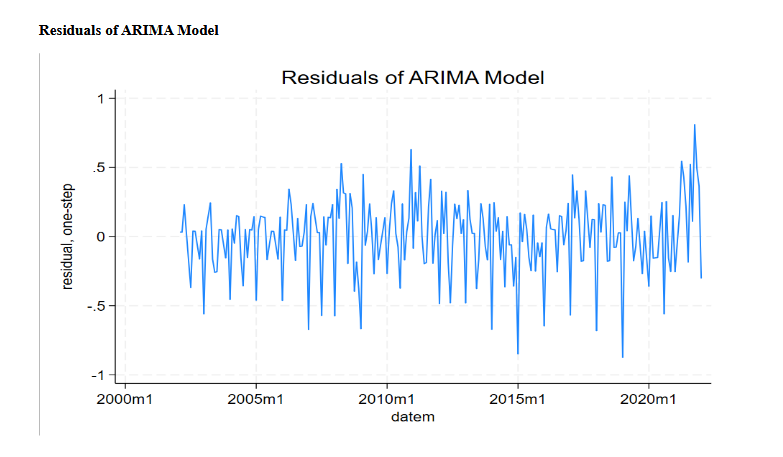
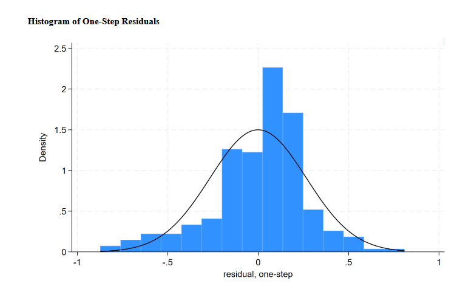
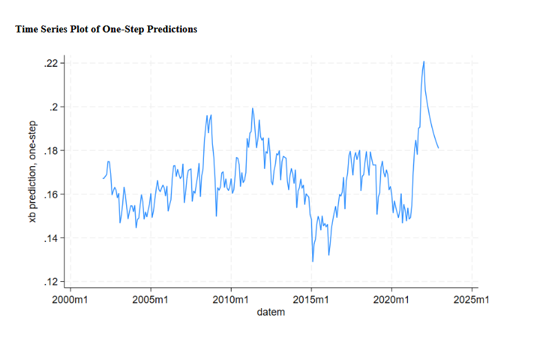

# UK CPI Time Series Forecasting

## Project Overview
## Project Report

This project summary includes:
- ARIMA model selection
- Stationarity testing
- ACF/PACF analysis
- Forecast evaluation
- Economic interpretation

[Download Project Summary PDF](forecasting_project_summary.pdf)
This project analyses and forecasts UK Consumer Price Index (CPI) trends using time series modelling techniques.

The study focuses on understanding inflation behaviour in the United Kingdom between 2002 and 2022 using historical CPI data and forecasting models.

## Objectives

- Analyse long-term UK inflation trends
- Identify patterns and seasonality in CPI data
- Apply time series forecasting techniques
- Interpret economic implications of inflation movements
- Evaluate forecasting accuracy and model behaviour

## Dataset

- UK CPI monthly dataset
- Period covered: 2002–2022
- 241 monthly observations
- Source: Office for National Statistics (ONS)

## Methodology

The project involved:

- Data cleaning and preparation
- Trend analysis
- Time series modelling
- Forecast generation
- Residual and diagnostic testing
- Interpretation of forecasting behaviour

## Tools Used

- Stata
- EViews
- Excel

## Key Topics

- Inflation Analysis
- Time Series Forecasting
- Economic Trends
- CPI Modelling
- Forecast Accuracy
- Financial Data Analysis

## Skills Demonstrated

- Time Series Analysis
- Forecasting Techniques
- Statistical Interpretation
- Economic Analysis
- Data Visualisation
- Econometric Modelling

## Research Highlights

- Analysed 20 years of UK inflation data
- Conducted forecasting using time series techniques
- Evaluated inflation movement patterns
- Applied econometric modelling tools
- Interpreted macroeconomic implications of inflation trends

## Author

Ardra Lekshmi  
MSc Finance & Investment (CFA Pathway)  
University of Aberdeen

## Visual Analysis

### UK CPI Trend Analysis

### ACF and PACF Analysis

### Differenced UK CPI ACF/PACF

### ARIMA Residual Analysis

### Residual Distribution

### One-Step Forecast Predictions

